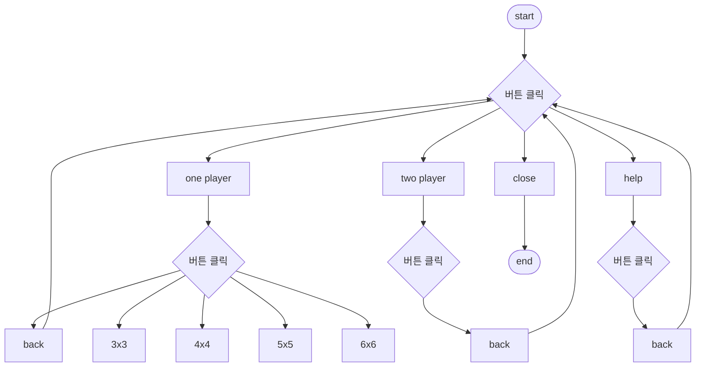

# 🎮 2인용 2048 게임 
---
## 📌 프로젝트 개요
- **기간**: 2019.04 ~ 2019.06  
- **개발 환경**: Eclipse  
- **사용 기술**: Java, XML, MVC Pattern  

---
## 🎯 프로젝트 목적
과거의 인기 게임인 크레이지 아케이드에서 영감을 받아, 2인용 모드가 포함된 2048 게임을 개발하고자 했습니다. 두 플레이어가 실시간으로 경쟁하며, 제한된 시간에 전략적인 아이템을 활용하여 상대를 이길 수 있는 게임을 구현했습니다.

## 👥 역할 분담
### 🙋‍♂️ 내 기여도
| 역할 | 상세 내용 |
|------|-----------|
| **2인용 모드 구현** | 두 플레이어가 동일 화면에서 실시간 경쟁 가능하도록 기능 추가 |
| **타이머 시스템** | 플레이어별 100초 제한, 0초 시 자동 종료 후 승자 결정 |
| **아이템 기능** | - `10` 합성 → 자신의 타이머 +10초 - `30` 합성 → 상대 타이머 -30초 |
| **오픈소스 분석** | 기존 MVC 구조 분석 후, 기능 확장 및 코드 개선 |

### 👥 팀 구성 및 역할 분담
- **본인**: 2인용모드 구현, 오픈소스 코드 분석 
- **팀원**: 새로운 게임 모드 추가 (5X5, 6X6 보드)
- **팀원**: UI 및 레이아웃 조정

---

## 🛠 주요 기능
### 1. 2인용 모드
- 동일 화면에서 두 플레이어가 실시간 경쟁
- 게임 상태 및 아이템 효과 즉시 반영
- 제한 시간 종료 시 점수 비교로 승자 결정

### 2. 타이머
- 각 플레이어에게 **100초 제한 시간** 부여
- 0초가 되면 게임 종료 후 점수 비교

### 3. 아이템 효과
- **10 합성** → 자신의 타이머 +10초  
- **30 합성** → 상대 타이머 -30초
  
---
## 시스템 구조

---
## 📖 배운 점 & 느낀 점
- 문자열 비교 시 `equals()`는 **boolean**을 반환하고, `compareTo()`는 **int**를 반환한다는 차이를 명확히 이해하게 되었습니다.  
- C 언어에서는 `if(1)`과 같은 표현이 가능하지만, Java에서는 허용되지 않아 `if` 조건문에 `compareTo()`를 직접 사용했을 때 의도한 대로 동작하지 않는 오류가 발생했습니다.  
- 당시 C 언어를 사용하는것에 더 익숙했기 때문에 문제 해결에 많은 시간이 걸렸지만, 이 과정을 통해 **언어 간 차이에 대한 이해**와 **문제 해결 과정의 중요성**을 배웠습니다.

---
## 📷 실행 화면

